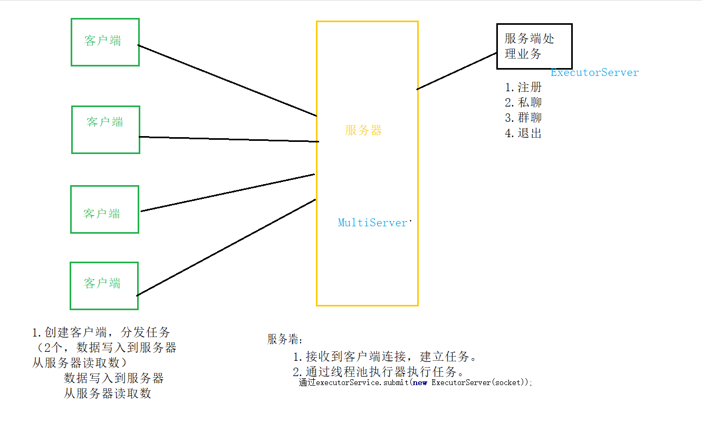

##项目名称
+ 多人聊天室
##项目描述
+ 支持多人同时注册、私聊、群聊和退出功能的网络聊天室
##项目实现
+ Java基础
+ Socket编程
+ 多线程
+ MySQL
+ JDBC
##项目功能
+ 注册
+ 私聊
+ 群聊
+ 退出
##项目实现

##测试结果
+ 平均响应时间：100ms
+ 支持同时在线用户：1000
##项目总结
+ 熟悉了项目的开发流程（提出问题-分析-技术选择-设计-编码-测试-打包发布）从无到有的设计、分析、实现
+ 掌握了Java的网络编程的常用的API和步骤
+ 提升了对多线程的优点的认识和熟练使用
+ 加深了Maven工具的理解和掌握
##优化与扩展
+ 优化
	 + 参数的严格校验
	 + 异常信息处理
	 + 用户体验（信息展示）
+ 扩展
	+ 数据存储到存储引擎（MySQL)
	+ 注册信息存储
	+ 增加登录功能（用户名+密码）
	+ 历史消息的存储

